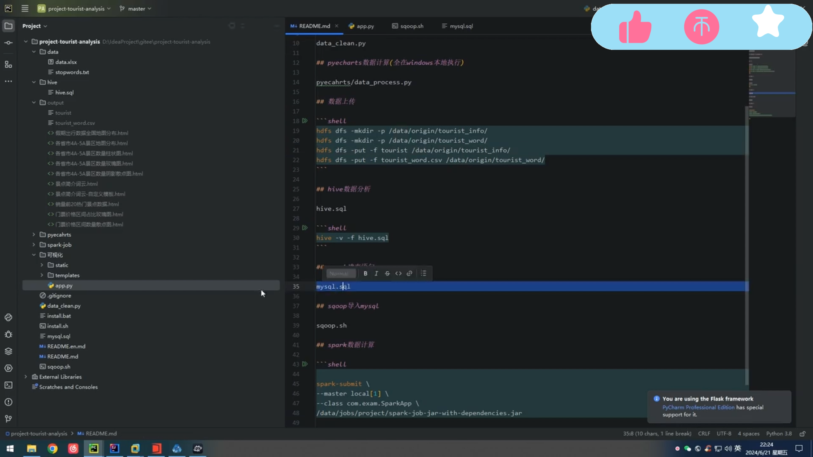
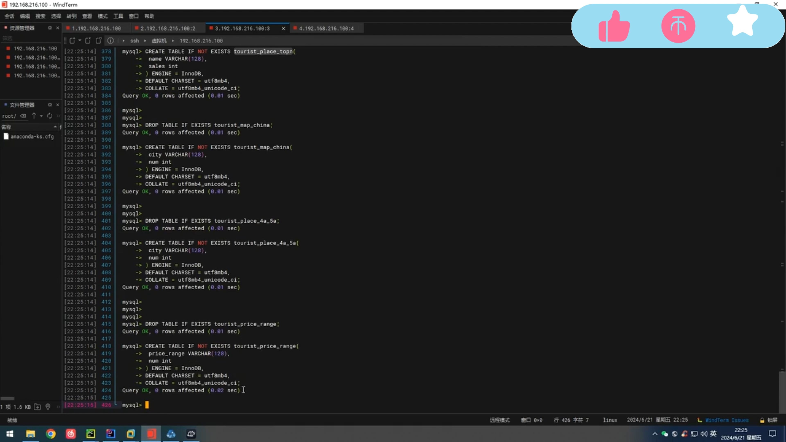
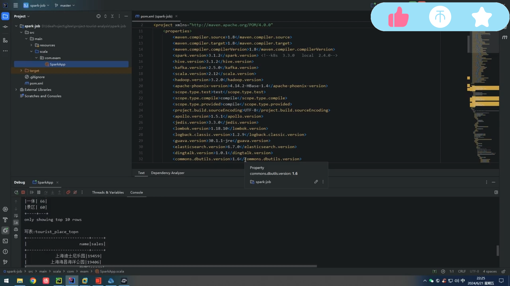
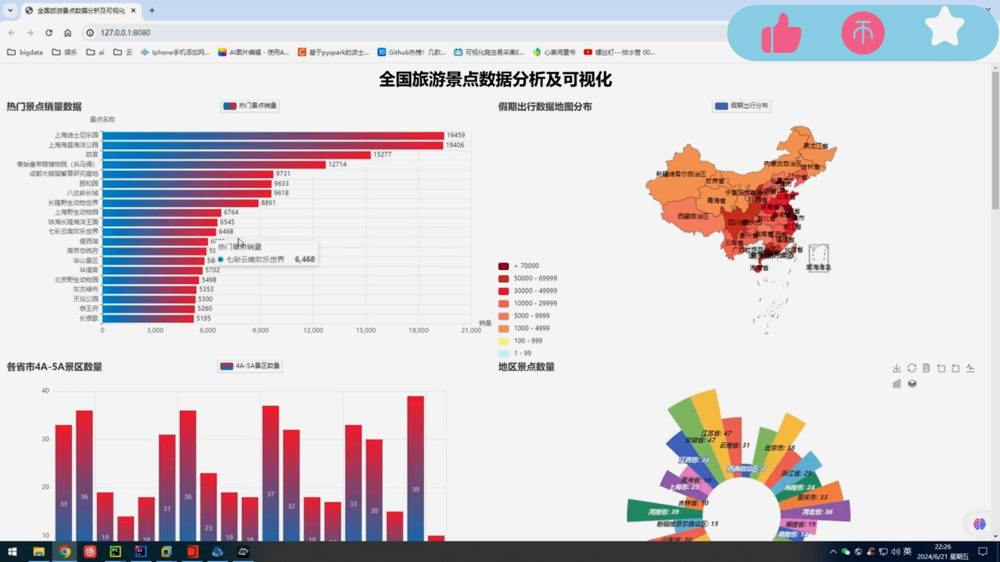
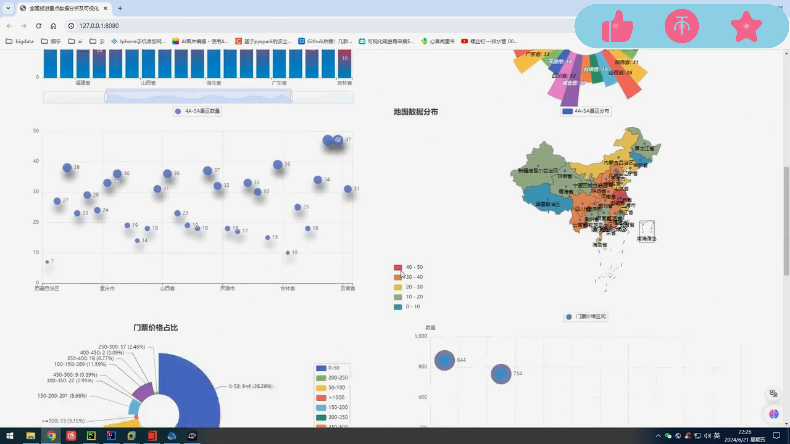
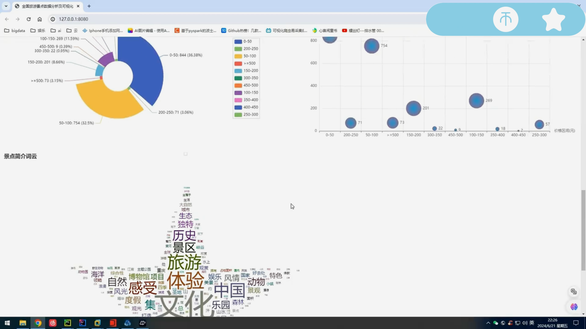
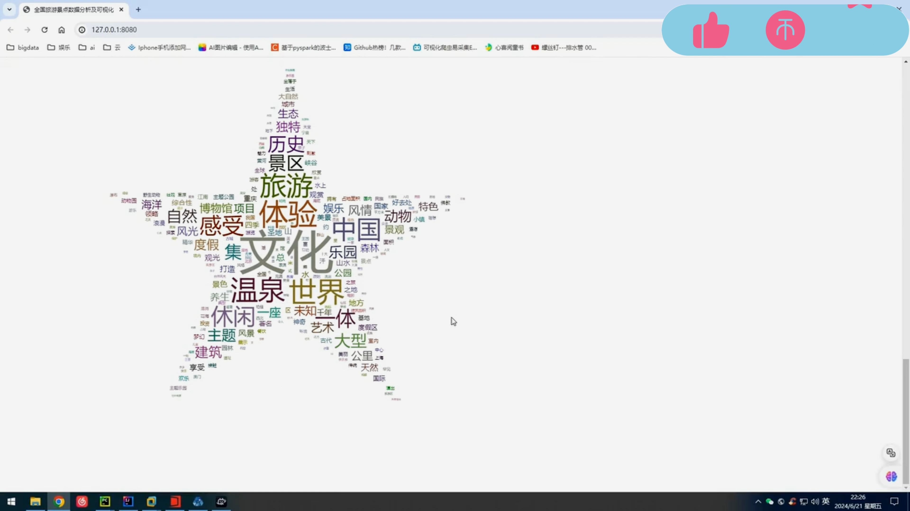

## 计算机毕业设计Hadoop+Spark旅游景点可视化 旅游景点推荐系统 景区游客满意度预测与优化 Apriori算法 景区客流量预测 旅游大数据 景点规划

## 要求
### 源码有偿！一套(论文 PPT 源码+sql脚本+教程)

### 
### 加好友前帮忙start一下，并备注github有偿Spark旅游可视化25
### 我的QQ号是2827724252或者798059319或者 1679232425或者微信:bysj2023nb 或bysj1688

# 

### 加qq好友说明（被部分 网友整得心力交瘁）：
    1.加好友务必按照格式备注
    2.避免浪费各自的时间！
    3.当“客服”不容易，repo 主是体面人，不爆粗，性格好，文明人。
	
## 功能
spark数据分析及可视化项目
介绍全国热门旅游景点数据分析及可视化案例
实验环境
Linux
python
Hadoop
Spark
mysql
web框架；flask
可视化工具；Echarts
图表可视化
自己写的，亲测都可以运行的

## 演示视频
https://www.bilibili.com/video/BV1m4421U7FS/?spm_id_from=333.999.0.0

## 演示视频

